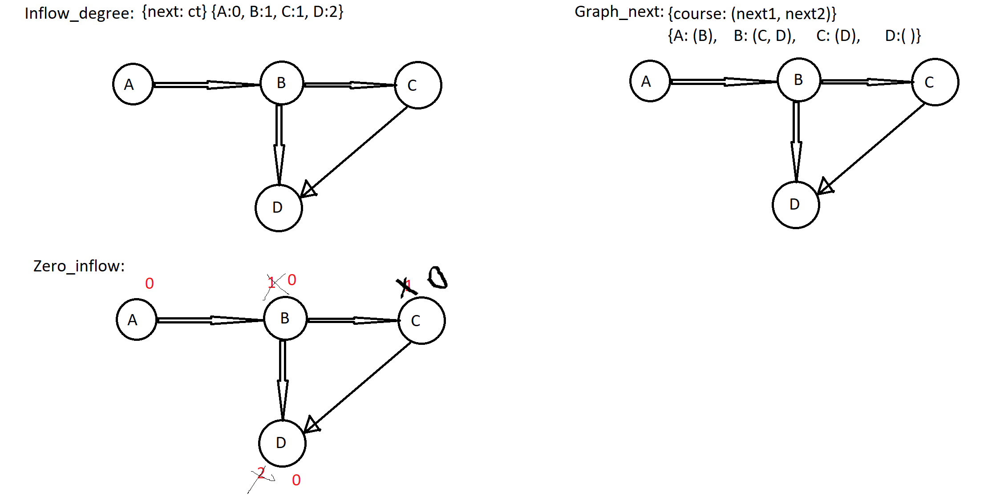

# Problem
[207. Course Schedule](https://leetcode.com/problems/course-schedule/)

There are a total of n courses you have to take, labeled from 0 to n-1.

Some courses may have prerequisites, for example to take course 0 you have to first take course 1, which is expressed as a pair: [0,1]

Given the total number of courses and a list of prerequisite pairs, is it possible for you to finish all courses?

**Examples:**
**Input: 2, [[1,0]]**
Output: true
Explanation: There are a total of 2 courses to take. 
             To take course 1 you should have finished course 0. So it is possible.
             

**Input: 2, [[1,0],[0,1]]**
Output: false
Explanation: There are a total of 2 courses to take. 
             To take course 1 you should have finished course 0, and to take course 0 you should
             also have finished course 1. So it is impossible.

# Algorithms
This is a typical graph problem. The nodes are courses and edges are the prerequisite relationship. 





From the prerequisite relationship, you can construct the graph with inflow and outflow information. 

```
graph_next    = {course: set() for course in range(numCourses)}
inflow_degree = {course: 0     for course in range(numCourses)}

for nxt, course in prerequisites:
    graph_next[course].add(nxt)
    inflow_degree[nxt] += 1
```

We need to find the course that we will be able to finish. To get such information, we will need to find the course that we don't need any prerequisite. From such courses, we will expand and find out which courses we can take. It is possible to finish all courses if you would be able to visit all the nodes. `learn` is `visited` in this dfs.

```
zeroInflow = [course for course in range(numCourses) if inflow_degree[course] == 0]

learn = []
while zeroInflow:
    course = zeroInflow.pop()
    for nxt in graph_next[course]:
        inflow_degree[nxt] -= 1
        if inflow_degree[nxt] <1:
            zeroInflow.append(nxt)
    learn.append(course)
```
# Code

```
graph_next    = {course: set() for course in range(numCourses)}
        inflow_degree = {course: 0     for course in range(numCourses)}
        
        for nxt, course in prerequisites:
            graph_next[course].add(nxt)
            inflow_degree[nxt] += 1
            
        zeroInflow = [course for course in range(numCourses) if inflow_degree[course] == 0]
        
        learn = []
        while zeroInflow:
            course = zeroInflow.pop()
            for nxt in graph_next[course]:
                inflow_degree[nxt] -= 1
                if inflow_degree[nxt] <1:
                    zeroInflow.append(nxt)
            learn.append(course)
        
        return len(learn) == numCourses
```

# Things I Learn from this Exercise
- Graph algorithms
- DFS in graph

# Test on LeetCode
Passed.
